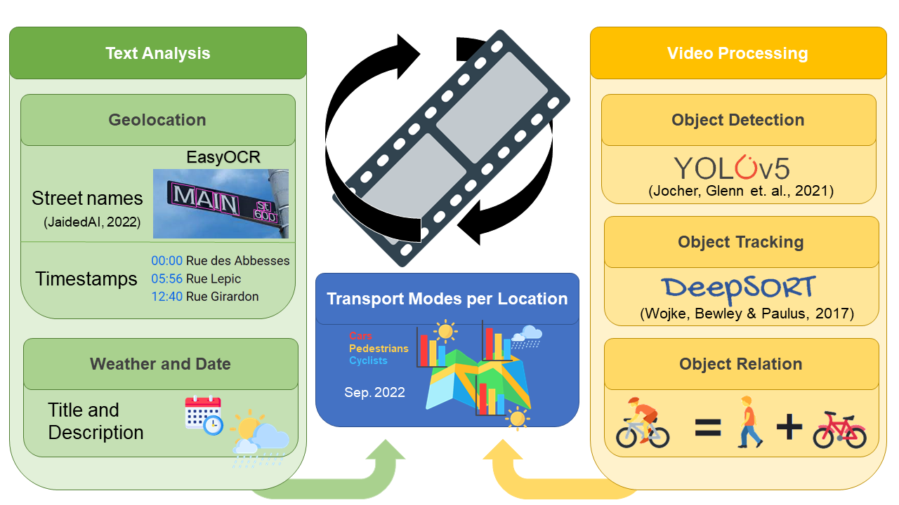
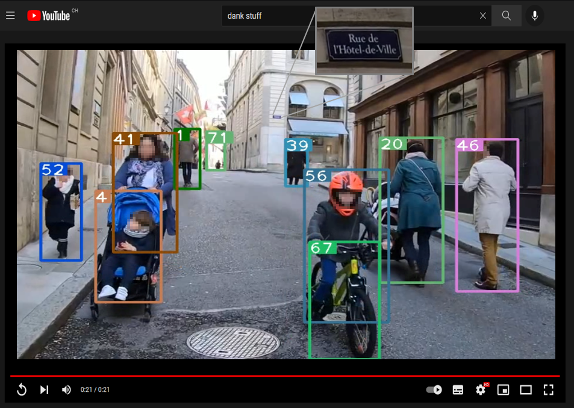
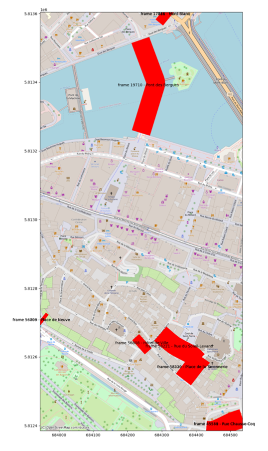
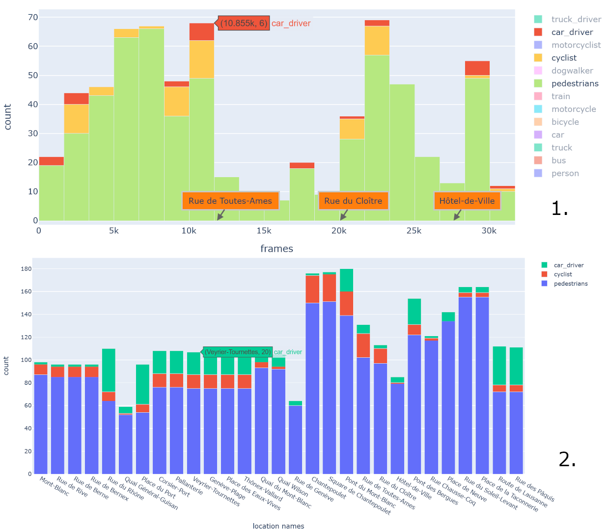

# Project to detect transportation modes in video footage

## Into

This work investigates the potential of analysing user-generated street view imagery from videos to extract transportation modes, for example whether individuals are walking or cycling, using deep neural-networks. It addresses existing data gaps with respect to monitoring the sustainability of the mix of transport modes in cities, and complements existing methods based on stationary count stations or Google Street View. Preliminary results show the potential of the proposed workflow to automatically extract forms of transportation from videos as alternative data form.

## Workflow

The workflow uses object detection [YOLOv5](https://github.com/mikel-brostrom/Yolov5_DeepSort_Pytorch/) and object tracking [DeepSort](https://github.com/nwojke/deep_sort) to identify transportation mode relevant objects and track anc count them across frames. Relations of relevant objects are used to infer transportation modes, such as a person in a certain relation to a bicycle suspects a cyclist. --> :bicyclist: = :walking: + :bike:

### Geolocation

Additionally to the transportation mode detection the workflow also perfroms text recognition which is referred to as Object Character Recognition (OCR) in Computer Vision terms. The extracted text is filtered for potential street names which are matched with the [Levenshtein Distance](https://towardsdatascience.com/calculating-string-similarity-in-python-276e18a7d33a) (word similarity) algorithm against a compiled dataset of OpenStreetMap street names which functions as gazetteer. The OCR is perfromed through the library [EasyOCR](https://pypi.org/project/easyocr/).
Ultimately, the workflow compiles all detected geolocations from a video in a map as output.

## Output

The workflow generates a project folder for each video with the following output files:

- track log CSV of all object IDs and their respective object class across frames
- OCR log CSV of all text strings extracted from all frames
- classnames CSV, a statistical summary of all detected classnames
- transportation mode CSV, a statistical summary of all detected transportation modes
- video MP4, containing visual bounding boxes and object ids

### Plots and figures
- map PNG, showing all detected geolocations from potential streetnames, each with a bargraph displaying transportation mode counts (see figure above)
- interactive plot HTML for each video (1), showing the distribution of detected objects and locations over the entire video
- interactive plot HTML, one for all videos (2), showing the detected object distribution for all locations from all videos

(respective examples can be found in `./example_plots`)

## Setup

To run the  `workflow.py` complete the folling steps:

1. Create the necessary virtual environment with Ananaconda
- `conda env create --file transport_env.yml`
- `conda activate transport_env`
2. Download video material (preferably as mp4), for YouTube one can use

`git clone https://github.com/Bellador/YoutubeDownloader`

3. Place videos in folder `input_videos`
4. Run `nohup python -u workflow.py > mylogfile.log &` 

## Presentation slides

GISRUK 2022 short presentation slides can be found under `./related_documents/markdown_presentation_FINAL/marp_presentation.html`

## Future Work

- Using sound-feeds of videos to infer traffic volumes based on the varying decibel levels

## External resources

The workflow is based on object (1) detection and (2) tracking as well as (3) Optical Character Recognition (OCR). These resources were taken from:

- (1) [YOLOv5](https://github.com/mikel-brostrom/Yolov5_DeepSort_Pytorch/)
- (2) [DeepSort](https://github.com/nwojke/deep_sort)
- (3) [EasyOCR](https://pypi.org/project/easyocr/)