<!-- _paginate: false -->
<!-- _color: #101010 -->

    Videos as Datasource for 
    Transportation Mode Detection

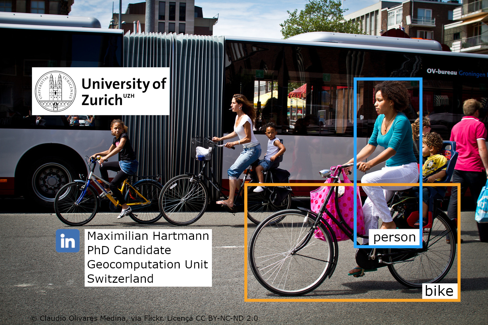

<!-- Start: Presentation on transport mode detection. How dow people get from A to B in urban areas? And how can we measure that? -->
--- 
## Why?

Transport is responsible for 24% of energy-related CO2 emissions 

###### (International Energy Agency; 2018)

.. we need to know how the mobility mix changes.

---
### Frameworks

##### Sustainable Development Goals  
68% of environment related indicators lack data availability 
###### (UN Environment Programme)

<!-- transport and mobility is central to SDG11 -->

---

### Indicator Requirements

- :black_square_button: spatial resolution
- :black_square_button: temporal resolution
- :black_square_button: feasible in cost and effort
- :black_square_button: reproducible

---

#### :chart_with_upwards_trend: Indicator for urban mobility

# :walking: , :bicyclist: 
###### (Wang et. al. 2020)

# :car: , :truck:

###### (den Braver et al. 2020)

# :station: , :bus:

<!-- non-motorised transport, non-motorised transport, public transport. Also consider motorcyclists -->

--- 

#### Conventional

- count stations
- surveys

<!-- Downsite: stationary, low differentiation between cyclists and others (e.g. e-scooters) -->

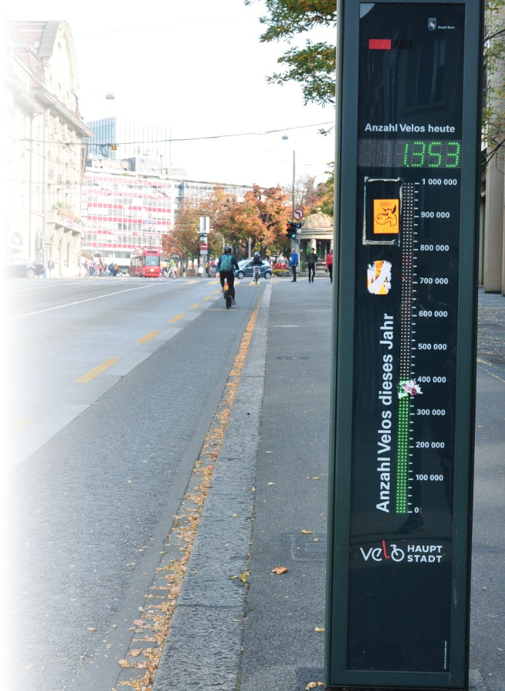

---

#### :thought_balloon: Complementary
#

- Micro-blogging e.g. Twitter, Weibo 
###### (Yang et. al. 2018)
- Fitness Apps e.g. STRAVA
###### (Georgios 2016)
- Images e.g. Flickr, Google Street View
######  (Domènech et. al. 2020) (Biljecki & Ito 2021)

<!-- geo-tagged, social media as example for UGC -->
<!-- "Street-level imagery became ingrained as an important urban data source" - but Urban analytics dominated by Google Street View -->

---

### :video_camera: City Tour Videos

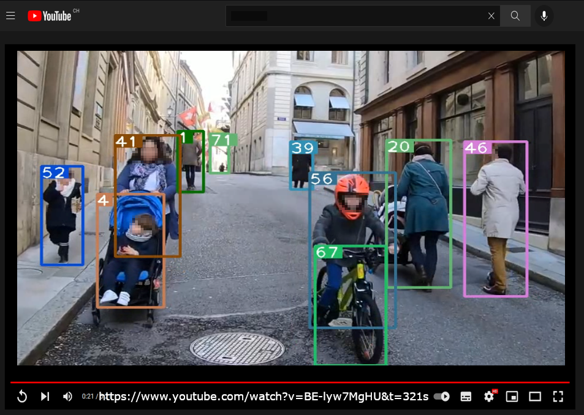

--- 

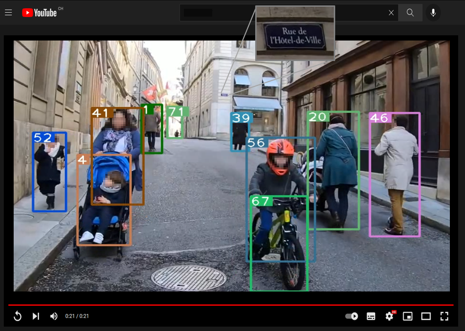

<!-- some CSI number plate zoom in -->

---

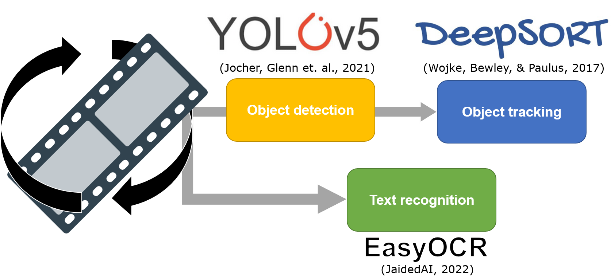

---

## Object relation

# :bicyclist: = :walking: + :bike:

###### (active transportation)

--- 

## :round_pushpin: Georeferencing

- process detected text
- match against OSM street-names gazetteer

###### (Al-Olimat et al., 2017)

<!-- Levensthein distance -->

---

## Results

---

####  :city_sunrise: Geneva
#
#
#
#
#
#
#
#
#
#
#
#
#

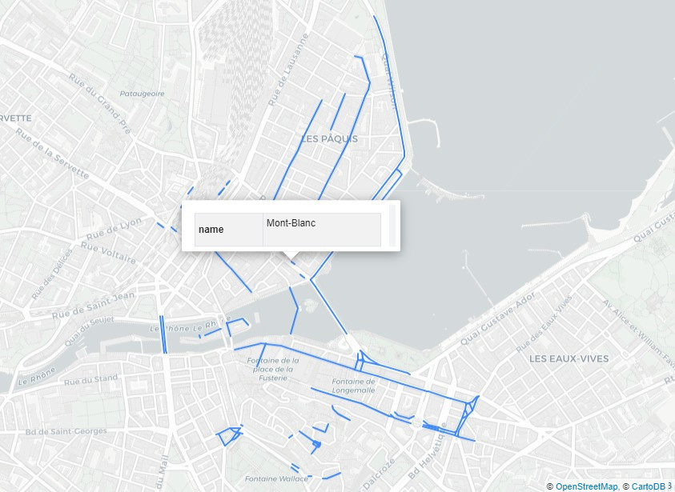

---
##### .. over multiple videos
<iframe src="./location_statistics_plot.html" height="600"></iframe>

---
##### Indicator - relative Proxy

<!-- Come back to the indicator that I want to create, this figure shows the potential of it to fingerprint locations and to compare them. 
Explain that the width of the bars correspond to the absolute values -->

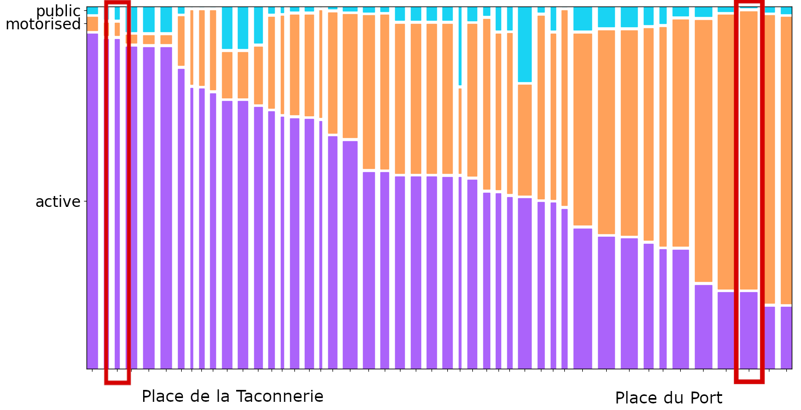

---

    Place de la Taconnerie
#
#
#
#
#
#
#
#
#
#
#
#
#

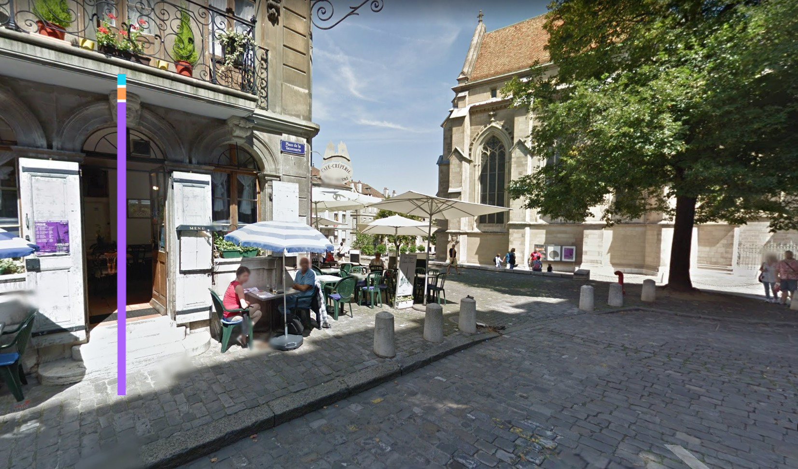

---

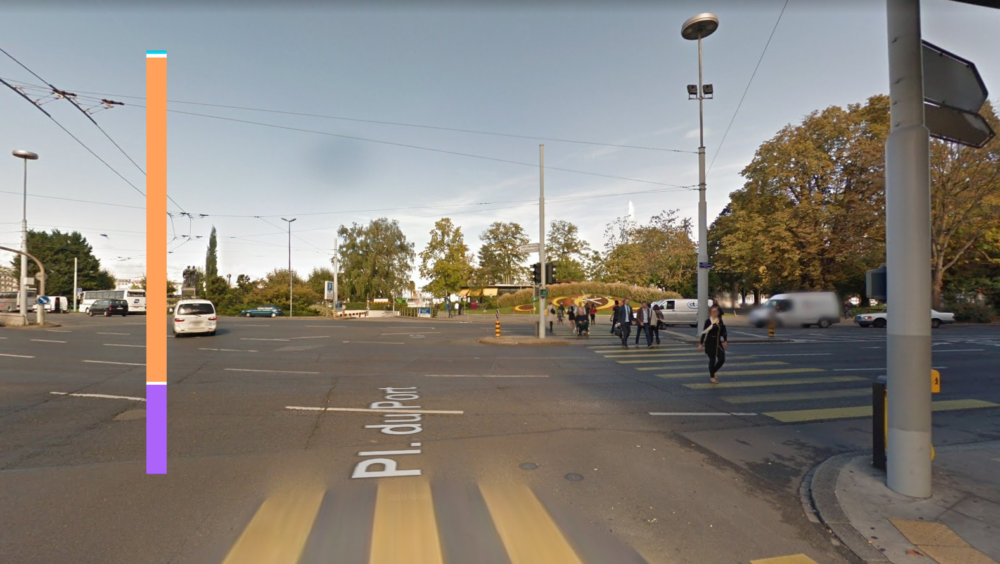

---

#### Verification on 5min

###

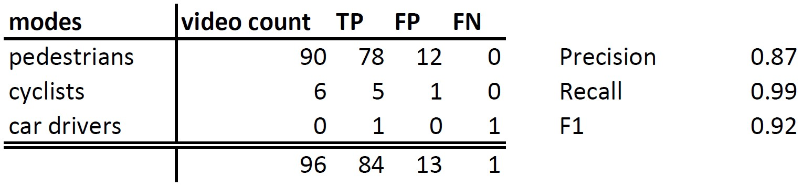

<!-- 5min video excerpt from a predestrian zone/transit mall (Fussgängerzone) -->

---

## :bulb: Conclusion

#

- :ballot_box_with_check: spatial resolution (OCR)
- :black_square_button: temporal resolution
- :ballot_box_with_check: feasible in cost and effort
- :ballot_box_with_check: reproducible

<!-- come back to the indicator requirements at the beginning + formulate some 'Take-Home Message' to summarise the talk -->

---

###### github.com/Bellador/TransportationDetection

---

### BACKUP SLIDES

---

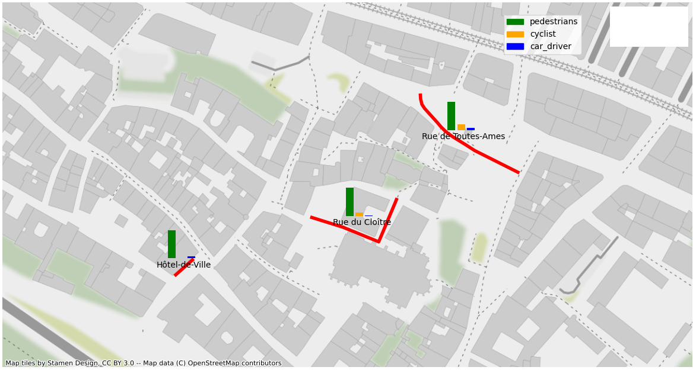

---

##### single video - aggregated
<iframe src="./figure_across_video.html" height="600"></iframe>
